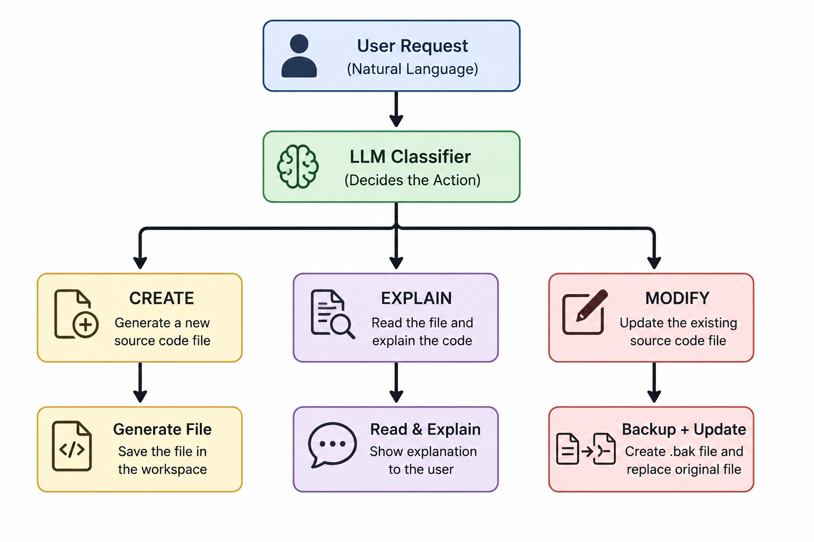

# Simple Single Coding Agent

A simple AI-powered coding agent built with **Python** and the **Ollama Python SDK**.

The agent uses a single Large Language Model (LLM) to understand natural language requests and automatically decide whether to:

* Create a new source code file
* Explain an existing file
* Modify an existing file

This project was developed as a university assignment without using any AI agent frameworks such as **LangChain**, **CrewAI**, **LangGraph**, **AutoGen**, **MCP**, or **RAG**.

---

## Workflow

<p align="center">
  
</p>

---

## Features

* Natural language interface
* Automatic action classification
* Create source code files
* Explain existing source code
* Modify existing source code
* Automatic `.bak` backup before file modifications
* Workspace protection against directory traversal
* Basic error handling

---

## Requirements

* Python 3.10 or later
* Ollama Python SDK
* Internet connection (required for `nemotron-3-super:cloud`)

Install the required package:

```bash
pip install -r requirements.txt
```

---

## Project Structure

```text
project/
│
├── docs/
│   └── agent_workflow.png
│
├── workspace/
│
├── main.py
├── test.py
├── requirements.txt
└── README.md
```

---

## Step 1 – Test the Model Connection

Before running the coding agent, verify that the connection to the LLM is working correctly.

Run:

```bash
python test.py
```

The script sends a simple request to the model. If everything is configured correctly, the model will return a valid response.

If an error occurs, check the following:

* Python is installed correctly.
* The required package is installed.
* You have an active internet connection.
* The model `nemotron-3-super:cloud` is available.

---

## Step 2 – Run the Coding Agent

After confirming that the model connection works, start the agent:

```bash
python main.py
```

The program first asks for a workspace directory.

Example:

```text
Enter workspace folder:
D:\Projects\workspace
```

After selecting the workspace, simply enter your request in natural language.

Examples:

```text
Create a Python calculator.
```

```text
Explain calculator.py
```

```text
Modify calculator.py and add comments.
```

The agent automatically classifies the request and performs the appropriate action.

---

## Example Workflow

### Create

Input:

```text
Enter your request:
Create a Python calculator.
```

The agent generates a new file, for example:

```text
calculator.py
```

inside the selected workspace.

---

### Explain

Input:

```text
Enter your request:
Explain calculator.py
```

The agent reads the file and provides a natural language explanation of the source code.

---

### Modify

Input:

```text
Enter your request:
Modify calculator.py and add input validation.
```

The agent:

1. Creates a backup file (`calculator.py.bak`)
2. Modifies the original source code
3. Saves the updated version inside the workspace

---

## Safety

The agent only operates inside the selected workspace.

Any attempt to access files outside the workspace is blocked.

Example:

```text
../../secret.txt
```

---

## Technologies

* Python
* Ollama Python SDK
* `nemotron-3-super:cloud`


---

## Author

**Mahmoud Shoaib**

Faculty of Computer Science

Egyptian Chinese University
